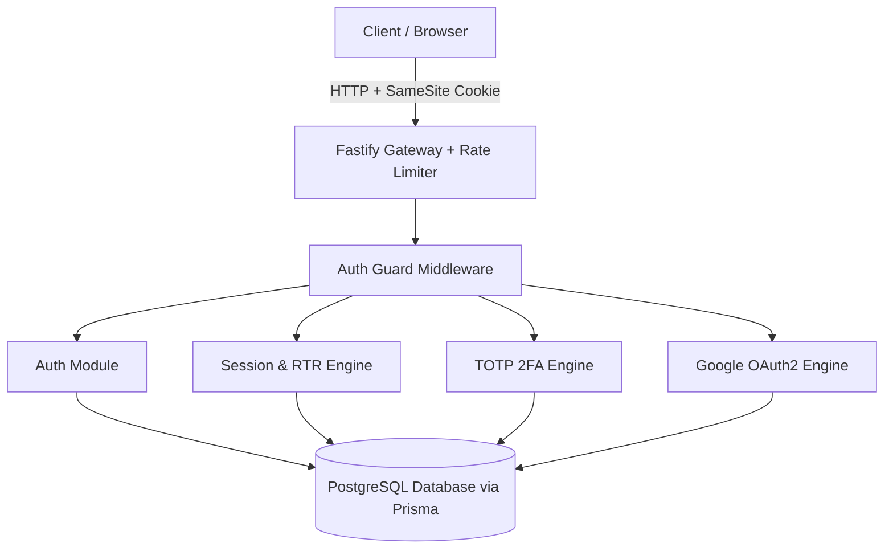
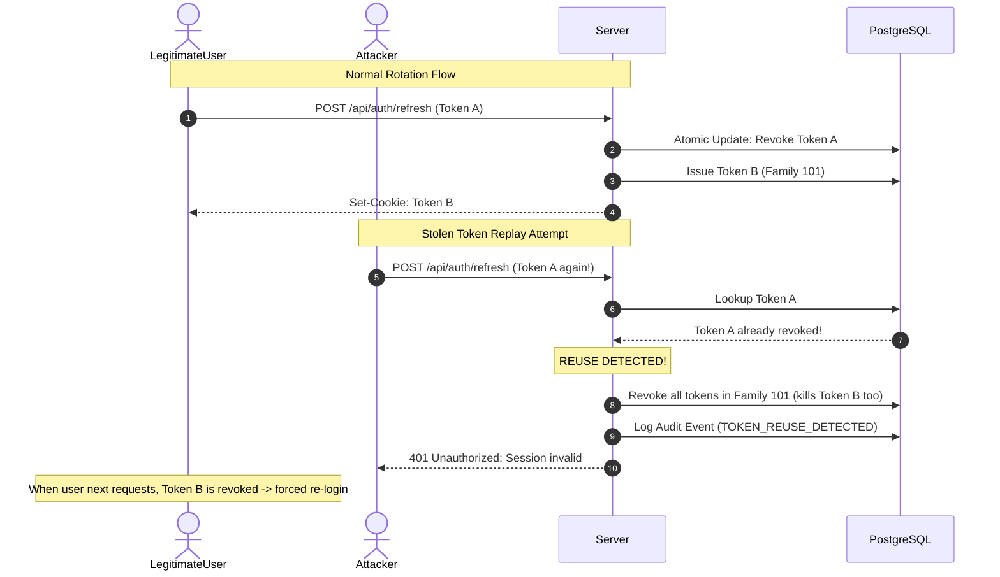
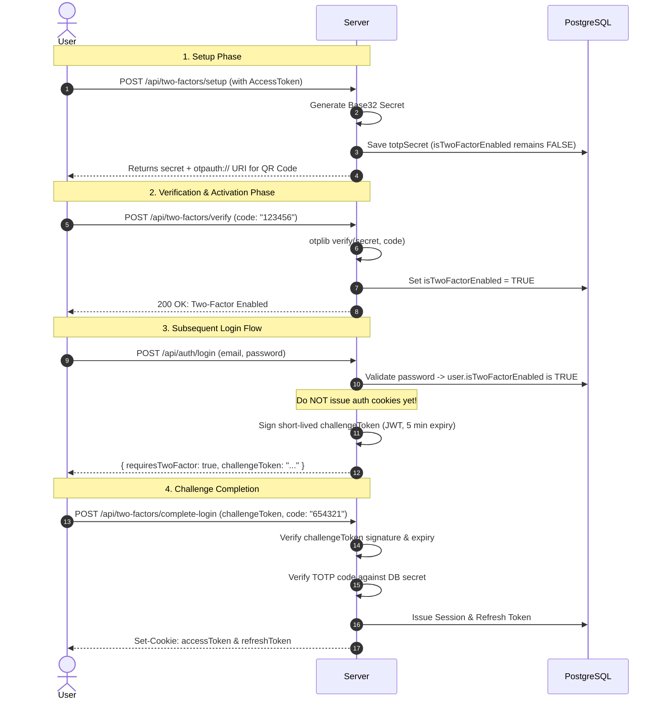
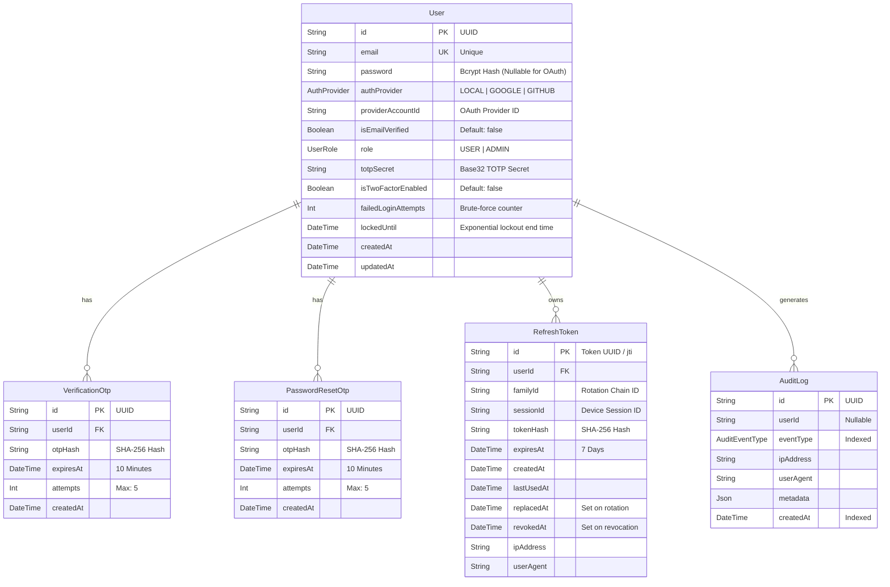

# Complete Architecture, Security, & Algorithm Documentation
**System**: Production-Ready Authentication & Authorization Engine (`auth-with-HttpOnly`)  
**Stack**: Node.js, Fastify, TypeScript, Prisma ORM, PostgreSQL, Zod, JWT, otplib, OAuth2

---

## 1. Executive Summary & System Overview

This project is an enterprise-grade authentication and session management backend engineered with a **defense-in-depth** security architecture. Unlike conventional tutorial authentication setups that store tokens in client-side storage or use static tokens, this system eliminates single points of failure across transport, storage, and application runtime.



---

## 2. Complete Feature Inventory

| Category | Implemented Features | Primary Files |
| :--- | :--- | :--- |
| **Framework & Engine** | Fastify 5 + Type-safe Zod provider + Auto OpenAPI/Swagger UI | [`app.ts`](file:///d:/Projects/BackendProjects/auth-with-HttpOnly/src/app.ts), [`swagger.plugins.ts`](file:///d:/Projects/BackendProjects/auth-with-HttpOnly/src/plugins/swagger.plugins.ts) |
| **Transport & Cookies** | HttpOnly, Secure, SameSite=Strict, Path-scoped Cookie Strategy | [`auth.controller.ts`](file:///d:/Projects/BackendProjects/auth-with-HttpOnly/src/modules/auth/controllers/auth.controller.ts) |
| **Credential Security** | Bcrypt password hashing (Cost Factor 12) | [`password.ts`](file:///d:/Projects/BackendProjects/auth-with-HttpOnly/src/lib/password.ts) |
| **Email Verification** | Cryptographic 6-digit OTP generation, SHA-256 DB hashing, Expiration, Attempt Throttling | [`otp.ts`](file:///d:/Projects/BackendProjects/auth-with-HttpOnly/src/utils/otp.ts), [`auth.service.ts`](file:///d:/Projects/BackendProjects/auth-with-HttpOnly/src/modules/auth/services/auth.service.ts) |
| **Account Protection** | Exponential Backoff Account Lockout ($1 \times 5^{n-1}$ minutes) against brute-force attacks | [`auth.service.ts`](file:///d:/Projects/BackendProjects/auth-with-HttpOnly/src/modules/auth/services/auth.service.ts) |
| **Token Architecture** | Dual-token model: Short-lived Access Token (15 min) + Refresh Token (7 days) | [`token.ts`](file:///d:/Projects/BackendProjects/auth-with-HttpOnly/src/utils/token.ts) |
| **Session & Token Rotation** | Refresh Token Rotation (RTR) + Family ID Reuse Detection + Atomic DB consumption | [`session.repository.ts`](file:///d:/Projects/BackendProjects/auth-with-HttpOnly/src/modules/sessions/repositories/session.repository.ts), [`auth.service.ts`](file:///d:/Projects/BackendProjects/auth-with-HttpOnly/src/modules/auth/services/auth.service.ts) |
| **Multi-Device Sessions** | Device & session tracking (`sessionId`), individual device revocation, global revocation | [`session.service.ts`](file:///d:/Projects/BackendProjects/auth-with-HttpOnly/src/modules/sessions/services/session.service.ts) |
| **Two-Factor Auth (2FA)** | RFC 6238 TOTP (Time-based One-Time Password), Authenticator QR code URI, 2-phase verification | [`two-factor.service.ts`](file:///d:/Projects/BackendProjects/auth-with-HttpOnly/src/modules/two-factor/types/two-factor.service.ts), [`two-factor.routes.ts`](file:///d:/Projects/BackendProjects/auth-with-HttpOnly/src/modules/two-factor/routes/two-factor.routes.ts) |
| **Social Login (OAuth2)** | Google OpenID Connect, PKCE & State cookie CSRF protection, Account conflict protection | [`google-oauth.ts`](file:///d:/Projects/BackendProjects/auth-with-HttpOnly/src/config/google-oauth.ts), [`oauth.service.ts`](file:///d:/Projects/BackendProjects/auth-with-HttpOnly/src/modules/oauth/services/oauth.service.ts) |
| **Auditing & Telemetry** | Centralized structured audit logs for security events (login, failed login, lockouts, token reuse) | [`audit.service.ts`](file:///d:/Projects/BackendProjects/auth-with-HttpOnly/src/modules/audit/services/audit.service.ts) |
| **API Documentation** | Automated interactive Swagger UI with full request/response schemas for 100% of endpoints | [`swagger.plugins.ts`](file:///d:/Projects/BackendProjects/auth-with-HttpOnly/src/plugins/swagger.plugins.ts) |

---

## 3. Deep-Dive Feature Breakdown: Architecture, Trade-Offs, & Algorithms

---

### Feature 1: Fastify vs. Express & Zod Type Provider

#### Why We Chose Fastify Over Express
1. **Throughput & Low Latency**: Fastify is built on top of `fast-json-stringify` and high-speed routing (`find-my-way` radix tree), achieving 2x–4x the requests per second of Express.
2. **Encapsulation Architecture**: Fastify uses an asynchronous plugin architecture with lexical scoping. This guarantees that plugin decorators and hooks (e.g., cookie parsers, error handlers) do not bleed across modules unless explicitly opted in with `fastify-plugin` (`fp`).
3. **End-to-End Schema Validation & Automatic OpenAPI**: Express requires disparate libraries for validation and Swagger docs. Fastify couples request validation, response serialization, and Swagger generation into a single source of truth using `fastify-type-provider-zod`.

#### Catastrophic Risks Prevented
- **Memory Leaks & Hook Collision**: Express's global middleware chain makes isolation impossible, causing middleware order bugs (such as the duplicate cookie decorator error resolved earlier).
- **Over-fetching & Data Leakage**: Fastify's response serializer filters response payloads strictly against the defined schema, guaranteeing that sensitive fields (e.g., `passwordHash`, `totpSecret`) cannot accidentally leak to the client even if returned by a database query.

---

### Feature 2: HttpOnly Path-Scoped Cookie Strategy vs. LocalStorage

#### Why We Chose HttpOnly Cookies Over LocalStorage
In standard token architectures, developers frequently store JWT access and refresh tokens in `localStorage` or `sessionStorage`. This is catastrophic in production:

```
+-------------------+---------------------------------------+---------------------------------------+
| Vulnerability     | localStorage / sessionStorage         | HttpOnly + SameSite Cookie (Used Here) |
+-------------------+---------------------------------------+---------------------------------------+
| XSS Script Attack | VULNERABLE: document.cookie / window  | IMMUNE: Browser JavaScript cannot     |
|                   | storage can be read by any injected   | read HttpOnly cookies under any       |
|                   | script and exfiltrated to attacker.   | circumstances.                        |
+-------------------+---------------------------------------+---------------------------------------+
| CSRF Attack       | IMMUNE (unless headers auto-attached) | MITIGATED: sameSite: "strict" blocks  |
|                   |                                       | cross-site request cookie inclusion.  |
+-------------------+---------------------------------------+---------------------------------------+
| Path Isolation    | NONE: Global to origin.               | ENFORCED: Refresh cookie is scoped    |
|                   |                                       | strictly to /api/auth/refresh.        |
+-------------------+---------------------------------------+---------------------------------------+
```

#### Path Scoping Implementation
- `accessToken`: Scoped to `path: "/"` with `maxAge: 15 * 60` (15 minutes).
- `refreshToken`: Scoped strictly to `path: "/api/auth/refresh"` with `maxAge: 7 * 24 * 60 * 60` (7 days).
- **Benefit**: On normal API requests (e.g., `/api/sessions`, `/api/audit-logs`), the browser *never sends the refresh token across the wire*, minimizing exposure window.

---

### Feature 3: Refresh Token Rotation (RTR) & Token Family Reuse Detection

#### The Threat Model
If an attacker steals a long-lived refresh token, they have persistent access to the account. Even worse, the legitimate user has no idea the token was stolen.

#### The Solution: Token Rotation + Token Families
1. Every time a refresh token is used, it is **revoked immediately** (`consumeRefreshToken`), and a **brand-new refresh token is issued**.
2. All tokens spawned from the initial login share a persistent `familyId`.
3. If an attacker attempts to use a revoked/stolen refresh token, or if a network race condition occurs:
   - The server detects `tokenRecord.revokedAt !== null`.
   - The server logs a `TOKEN_REUSE_DETECTED` audit event.
   - The server executes `revokeTokenFamily(tokenRecord.familyId)`, instantly invalidating **every token in the chain**.
   - Both the attacker and the legitimate user are forced to log in again, neutralizing the attack.



#### Atomic DB Consumption Algorithm
To prevent race conditions where two simultaneous requests use the same token before revocation completes, `consumeRefreshToken` uses an atomic `updateMany` with a conditional filter:
```sql
UPDATE "RefreshToken" 
SET "revokedAt" = NOW(), "replacedAt" = NOW() 
WHERE "id" = :id AND "revokedAt" IS NULL;
```
If `result.count === 0`, another process already consumed the token, triggering the family revocation circuit breaker.

---

### Feature 4: Password Hashing with Bcrypt (Cost Factor 12)

#### Why Bcrypt (Cost 12) Over SHA-256 / MD5
- Standard cryptographic hashes (SHA-256, SHA-512, MD5) are designed for speed (gigabytes per second). An attacker with an RTX 4090 GPU can compute over **10 billion SHA-256 hashes per second**, cracking 8-character passwords in minutes.
- **Bcrypt** is a key derivation function designed specifically to be computationally expensive (memory-hard and CPU-intensive).
- Cost factor `12` means $2^{12} = 4096$ iterations of the Blowfish cipher, requiring ~250–350ms per verification. This makes offline dictionary and rainbow table attacks computationally intractable.

---

### Feature 5: Email Verification & Password Reset with SHA-256 OTP Hashing

#### The Vulnerability in Standard OTP Storage
Most backends store active OTPs in plaintext in the database (e.g., `verification_code: "123456"`). If an attacker obtains a database read snapshot (via SQL Injection, backup exposure, or read replica compromise), they can read all active OTPs and take over any account.

#### Our Hashed-OTP Architecture
1. Server generates a cryptographically secure random number using `crypto.randomInt(100000, 1000000)`.
2. The server sends the plaintext code via email via Nodemailer.
3. The server immediately computes:
   $$\text{hash} = \text{SHA-256}(\text{OTP})$$
4. Only the hash is saved in `VerificationOtp` and `PasswordResetOtp`.
5. Upon user submission, the input is hashed and compared against `otpHash`.
6. Even with a full database dump, an attacker cannot invert SHA-256 to obtain the plain 6-digit code.

#### Defense Features
- **Max Attempt Ceiling (`OTP_MAX_ATTEMPTS = 5`)**: Prevents online brute force of the 6-digit code space ($10^6$ possibilities). After 5 failed attempts, the code is locked.
- **Strict Expiration (`OTP_EXPIRES_IN_MINUTES = 10`)**: Limits the attack window.
- **Immediate Deletion on Success**: `deleteVerificationOtpsForUser()` purges all OTP records upon successful verification, ensuring zero replay.

---

### Feature 6: Exponential Backoff Account Lockout

#### The Problem
Fixed lockouts (e.g., "lock for 5 minutes after 5 failed attempts") allow automated botnets to sleep for 5 minutes and resume password cracking indefinitely.

#### Our Adaptive Exponential Lockout Algorithm
When a user fails password authentication, `failedLoginAttempts` increments. Once `failedLoginAttempts >= 5`, the account is locked for a duration that grows exponentially:

$$\text{lockoutCount} = \left\lfloor \frac{\text{failedLoginAttempts}}{\text{MAX\_FAILED\_ATTEMPTS}} \right\rfloor$$
$$\text{lockoutMinutes} = \text{baseMinutes} \times 5^{(\text{lockoutCount} - 1)}$$

```
+-----------------------+------------------+-----------------------------+
| Failed Attempts Range | Lockout Count    | Lockout Duration            |
+-----------------------+------------------+-----------------------------+
| 5 - 9 attempts        | 1st Lockout      | 1 minute                    |
| 10 - 14 attempts      | 2nd Lockout      | 5 minutes                   |
| 15 - 19 attempts      | 3rd Lockout      | 25 minutes                  |
| 20 - 24 attempts      | 4th Lockout      | 125 minutes (~2 hours)      |
| 25+ attempts          | 5th Lockout      | 625 minutes (~10.4 hours)   |
+-----------------------+------------------+-----------------------------+
```

This renders automated distributed credential stuffing mathematically unfeasible while avoiding permanent account denial of service.

---

### Feature 7: Two-Factor Authentication (TOTP / RFC 6238)

#### Why RFC 6238 TOTP Over SMS OTP
- SMS-based 2FA is susceptible to **SIM-swapping attacks**, SS7 cellular network interception, and social engineering of mobile carrier reps.
- **RFC 6238 TOTP** uses a shared cryptographic secret key stored on the device (Google Authenticator, Apple Passwords, 1Password) and the HMAC-SHA1 of the current Unix epoch time divided into 30-second windows:
  $$\text{TOTP}(K, T) = \text{Truncate}(\text{HMAC-SHA-1}(K, \lfloor T / 30 \rfloor))$$
- TOTP works offline, cannot be intercepted over cellular networks, and has zero per-SMS operational costs.

#### The 2-Phase Login & Activation Security Flow
A common vulnerability is activating 2FA without proving the user scanned the QR code. We enforce strict two-phase flows for both activation and authentication:



---

### Feature 8: Google OAuth 2.0 with PKCE & CSRF State Cookies

#### The Attack: OAuth Login CSRF
In naive OAuth implementations, an attacker initiates an OAuth flow on their own account, catches the redirect callback with the authorization `code`, and tricks a victim's browser into executing the callback. The victim's browser session is then tied to the attacker's account, exfiltrating the victim's data.

#### Our Defense: Cryptographic State Cookie
1. When `/api/auth/google` is called, `@fastify/oauth2` generates a high-entropy random string `state`.
2. The `state` is stored in an encrypted/HttpOnly cookie `oauth2-redirect-state` on the client.
3. The user is redirected to Google with `?state=<state>`.
4. Google redirects back to `/api/auth/google/callback?code=...&state=<state>`.
5. The callback handler verifies that the `state` query parameter **strictly matches** the `oauth2-redirect-state` cookie.
6. The state cookie is immediately deleted. If the state doesn't match or the cookie is absent, the request is rejected as an invalid CSRF attempt.

#### Account Conflict Protection
If a user registered with local password authentication (`email: "user@gmail.com"`), and later clicks "Sign in with Google", our service **does not blindly merge accounts**:
```ts
if (!user) {
  const existingUser = await finduserByEmail(providerUser.email);
  if (existingUser) {
    throw conflict("An account with this email already exists. Please log in with your existing account.");
  }
}
```
This blocks account takeover attacks where an attacker creates a Google account using an unverified email address matching an existing local user.

---

### Feature 9: Multi-Device Session Management

#### The Problem
In standard stateless JWT setups, a user cannot view their active devices or log out of a lost laptop without changing their password and revoking all tokens.

#### Our Session Tracking Architecture
In the database schema, every login session creates a distinct `sessionId` while tracking the device fingerprint:
- `id`: Unique Refresh Token UUID (`jti` claim in the JWT).
- `sessionId`: Unique identifier representing a device/login session.
- `familyId`: Rotation chain identifier for theft detection.
- `userAgent`: Client operating system, browser version.
- `ipAddress`: Network IP address.
- `lastUsedAt`: Timestamp of the most recent token refresh.

#### Available Operations:
1. `GET /api/sessions`: Returns all active devices for the user (`id`, `userAgent`, `ipAddress`, `createdAt`, `lastUsedAt`).
2. `DELETE /api/sessions/:sessionId`: Revokes that specific device session without terminating other sessions.
3. `POST /api/auth/log-out`: Revokes the current device session and wipes cookies.
4. `Password Reset`: Automatically calls `revokeAllUserRefreshTokens(userId)` to invalidate all devices immediately when credentials change.

---

### Feature 10: Security Auditing & Telemetry

All critical identity lifecycle events are recorded asynchronously in the `AuditLog` table:

```
+-----------------------+-------------------------------------------------------------+
| Event Type            | Triggering Condition                                        |
+-----------------------+-------------------------------------------------------------+
| REGISTER              | User account created                                        |
| EMAIL_VERIFIED        | Email ownership validated with OTP                          |
| LOGIN_SUCCESS         | Successful authentication (local or OAuth)                  |
| LOGIN_FAILED          | Bad password or invalid email attempt                       |
| ACCOUNT_LOCKED        | Failed attempt threshold reached; lockout timer applied     |
| TOKEN_REUSE_DETECTED  | Revoked refresh token submitted (potential token theft)     |
| PASSWORD_RESET        | Password successfully updated via reset OTP                 |
| LOGOUT                | User session explicitly terminated                          |
| SESSION_REVOKED       | Specific device session revoked                             |
+-----------------------+-------------------------------------------------------------+
```

Every audit entry captures `userId`, `eventType`, `ipAddress`, `userAgent`, and `createdAt` with database indexing on `[userId]`, `[eventType]`, and `[createdAt]` for high-speed security queries.

---

## 4. Complete Database Schema (Entity-Relationship)



---

## 5. Security Threat Matrix & Defenses

| Threat Vector | Attack Mechanism | Countermeasure Implemented |
| :--- | :--- | :--- |
| **XSS Token Exfiltration** | Malicious script steals JWT from storage | HttpOnly cookies cannot be read by JavaScript APIs. |
| **CSRF Attacks** | Cross-site unauthorized state-changing calls | `SameSite: "Strict"` cookies + OAuth State verification. |
| **Refresh Token Theft** | Attacker intercepts or replays refresh token | Token Rotation + Family Revocation (wipes entire family on reuse). |
| **Credential Stuffing** | Automated bots testing leaked password lists | Adaptive Exponential Lockout ($1 \times 5^{n-1}$ min) + Global Rate Limiter. |
| **Database Compromise** | Attacker steals database dump | Passwords hashed with Bcrypt-12; OTPs hashed with SHA-256. |
| **SIM Swap Attacks** | Intercepting SMS-based 2FA codes | RFC 6238 TOTP authenticator app tokens (no cellular dependency). |
| **OAuth Login CSRF** | Attacker binds victim session to attacker's profile | Cryptographic state cookie verified during authorization code exchange. |
| **Token Replay / Desync** | Simultaneous requests refreshing the same token | Atomic conditional SQL update (`WHERE revokedAt IS NULL`). |
| **Timing Attacks** | Measuring response times on password/hash checks | Constant-time comparisons (`bcrypt.compare`, `timingSafeEqual`). |
