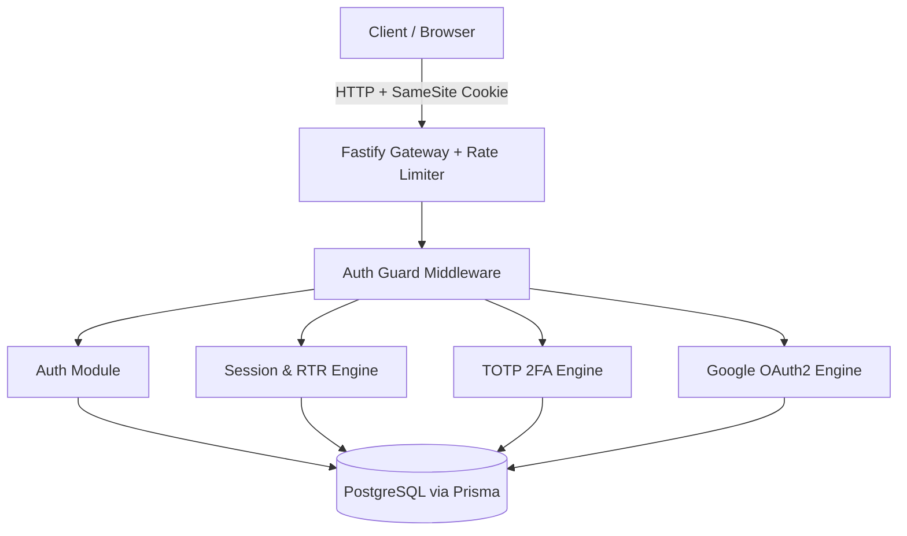
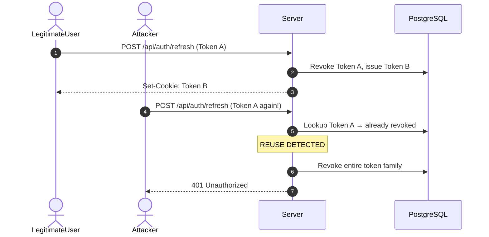
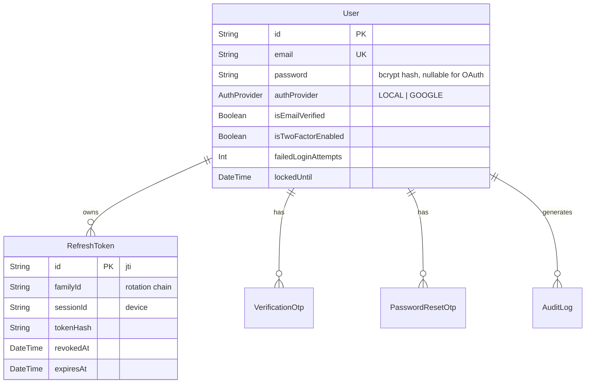

# Auth backend

**Stack:** Node.js · Fastify 5 · TypeScript · Prisma · PostgreSQL · Zod · JWT · otplib · OAuth2

---
## Architecture at a glance



---

## Features

| Area | What it does |
|---|---|
| **Framework** | Fastify 5 + Zod type provider → request validation, response serialization, and Swagger docs from one schema |
| **Cookies** | HttpOnly, Secure, `SameSite=Strict`, path-scoped (refresh cookie only ever sent to `/api/auth/refresh`) |
| **Passwords** | Bcrypt, cost factor 12 (~250–350ms per hash — makes offline cracking impractical) |
| **Email verification** | 6-digit OTP, SHA-256 hashed in DB, 10-min expiry, 5-attempt cap |
| **Account lockout** | Exponential backoff (1 min → 5 min → 25 min → 2 hr → 10+ hr) instead of a fixed cooldown bots can just sleep through |
| **Tokens** | Short-lived access token (15 min) + refresh token (7 days) |
| **Refresh rotation** | Every refresh **rotates** the token and **detects reuse** — a stolen/replayed token kills the entire session family instantly |
| **Sessions** | Per-device session tracking; revoke one device or all of them |
| **2FA** | RFC 6238 TOTP (Google Authenticator-style), 2-phase setup + login flow |
| **OAuth** | Google login with PKCE + CSRF state-cookie verification, account-conflict protection |
| **Audit log** | Every security-relevant event (login, lockout, token reuse, etc.) recorded with IP/user-agent |
| **API docs** | Full Swagger UI, auto-generated from the same Zod schemas that validate requests |

---

## How the dangerous parts are handled

**Stolen refresh token?** Every refresh token is single-use. Reusing an already-consumed one (a stolen token replayed by an attacker) instantly revokes every token in that login's family — both attacker and legitimate user get logged out and have to re-auth.



**Database gets dumped?** Passwords are bcrypt-12 hashed. OTPs are SHA-256 hashed — even a full DB leak doesn't hand out plaintext 6-digit codes.

**Bot tries to brute-force login?** Failed attempts trigger lockouts that grow exponentially (`1 × 5ⁿ⁻¹` minutes), so a bot can't just wait out a fixed cooldown and keep hammering.

**OAuth CSRF?** Every Google login round-trip is protected by a cryptographic `state` value stored in an HttpOnly cookie and checked on callback — and if someone already has a local account with that email, Google sign-in refuses to silently merge into it.

---

## API surface

| Method | Endpoint | Purpose |
|---|---|---|
| `POST` | `/api/auth/register` | Create account, triggers OTP email |
| `POST` | `/api/auth/verify-email` | Confirm email with OTP |
| `POST` | `/api/auth/resend-otp` | Resend verification OTP |
| `POST` | `/api/auth/login` | Password login (or 2FA challenge if enabled) |
| `POST` | `/api/auth/refresh` | Rotate access/refresh token pair |
| `POST` | `/api/auth/log-out` | Revoke current session |
| `POST` | `/api/auth/forgot-password` / `/reset-password` | OTP-based password reset |
| `GET` | `/api/auth/google` | Start Google OAuth flow |
| `GET` | `/api/auth/google/callback` | OAuth callback (state-verified) |
| `POST` | `/api/two-factors/setup` | Generate TOTP secret + QR |
| `POST` | `/api/two-factors/verify` | Activate 2FA (proves QR was scanned) |
| `POST` | `/api/two-factors/complete-login` | Finish a 2FA-gated login |
| `GET` | `/api/sessions` | List active devices |
| `DELETE` | `/api/sessions/:sessionId` | Revoke one device |

Full interactive docs (request/response schemas, try-it-out): **`/docs`** once the server is running.

---

## Data model (simplified)



---

## Threat model summary

| Threat | Defense |
|---|---|
| XSS token theft | HttpOnly cookies — JS can't read them, period |
| CSRF | `SameSite=Strict` + OAuth state-cookie verification |
| Refresh token theft | Rotation + family-wide revocation on reuse |
| Credential stuffing | Exponential lockout + rate limiting |
| DB compromise | Bcrypt-12 passwords, SHA-256 OTPs |
| SIM-swap (2FA bypass) | TOTP (RFC 6238), not SMS |
| Token replay race conditions | Atomic conditional SQL update on token consumption |
| Timing attacks | Constant-time comparisons (`bcrypt.compare`, `timingSafeEqual`) |

---

## Getting started

```bash
git clone <your-repo-url>
cd auth-with-HttpOnly
npm install

cp .env.example .env   # fill in DB URL, JWT secrets, Google OAuth creds, SMTP config

npx prisma migrate dev
npm run dev
```

Server starts at `http://127.0.0.1:3000` — interactive API docs at `http://127.0.0.1:3000/docs`.

---

## Deep dive

This README is the quick tour. For the full write-up — every algorithm, threat model, and design trade-off in detail — see [`DOCUMENTATION.md`](./DOCUMENTATION.md).
